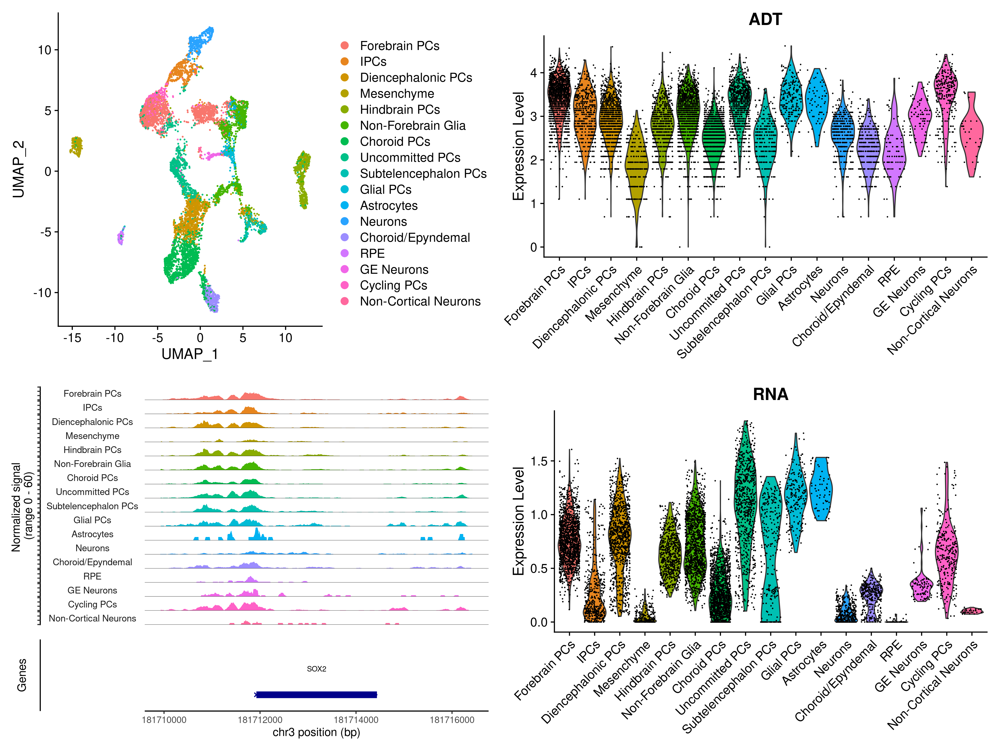

<!DOCTYPE html>
<html>
<head>
    <title>Dropdown Menu Example</title>
</head>
<body>
    <label for="category">Select a dataset:</label>
    <select id="category">
        <option value="" selected disabled>Select an antibody</option>
        <option value="SOX2">SOX2</option>
        <option value="GLI3">GLI3</option>
    </select>
     
    
    
</body>
</html>

