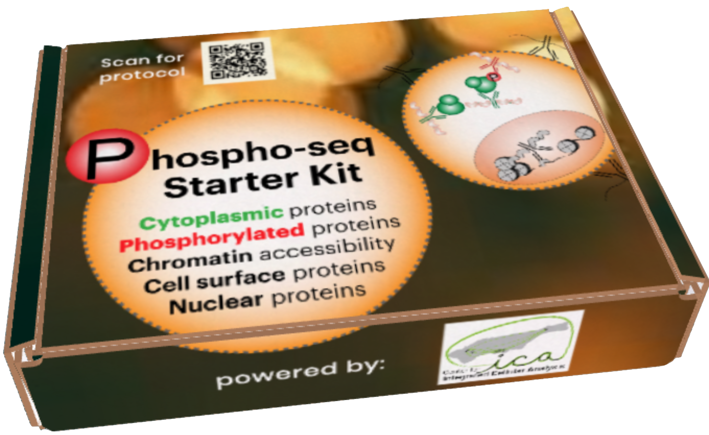

### About the Kits 
 In collaboration with the <a href="https://www.multimodalintegration.org/" target="_blank">Center for Integrated Cellular Analysis</a>, We are happy to offer Phospho-seq Starter Kits to make it easier for users to try Phospho-seq out for themselves!
        
We have observed that one of the largest obstacles in performing antibody-based single-cell protein profiling including <a href="https://www.nature.com/articles/s41587-021-00927-2" target="_blank">ASAP-Seq</a>, <a href="https://www.nature.com/articles/s41592-021-01278-1" target="_blank">InCite-Seq</a>, <a href="https://www.nature.com/articles/s41592-022-01461-y" target="_blank">NEAT-Seq</a>, <a href="https://www.sciencedirect.com/science/article/pii/S2667237521001223" target="_blank">QURIE-Seq</a> and others is the limited commercial availability of pre-conjugated antibodies, especially for intracellular proteins. For Phospho-seq we adapted an already established <a href="https://www.nature.com/articles/srep22675" target="_blank">click-chemistry-based DNA-antibody conjugation method</a>  to create large panels of custom conjugated antibodies. In this Phospho-seq starter kit, we provide the material to conjugate up to four antibodies of the user's choice with four separately indexed labeled TSB DNA oligos as well as a pre-conjugated control antibody for phospho-RPS6. We also provide a bridge oligo for use in the 10X scATAC-seq and scMultiome kits for antibody capture.

We hope that these kits remove some of the barriers of entry to using this technology and are excited to see what users do with them!

While the official distribution program for the kits has ended, I am happy to send kits to prospective users if they provide a shipping label. Please e-mail me <a href="mailto:jblair@nygenome.org">here</a> to inquire.

### Kit Components
- 20 mM mTz-PEG4-NHS (Click Chemistry Tools: 1069-10)
  - 5 ul 
- 50 kDa MW cutoff filters (EMD Millipore: UFC 505024)
  - 1
- 30 kDA MW cutoff filters (EMD Millipore: UFC 503096)
  - 4
- 1 M glycine (BioBasic – GB0235-500 (powder))
  - 20 ul
- 1X BBS buffer (Rockland - MB-050-1000)
  - 15 ml
- TCO-PEG4-Gly (Made from Click Chemistry Tools: A137-10 and glycine)
   - 50 ul
- TCO-PEG labeled TSB oligos
  - 4 separately indexed oligos
  - 10 ul/ oligo
- Pre-conjugated pRPS6 antibody
  - 5 ul (3 ug)
- Bridge Oligo B
  - 5 ul

